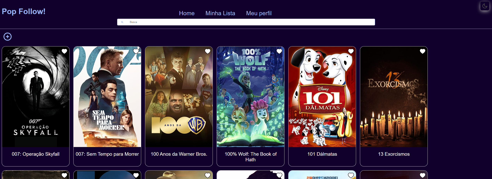
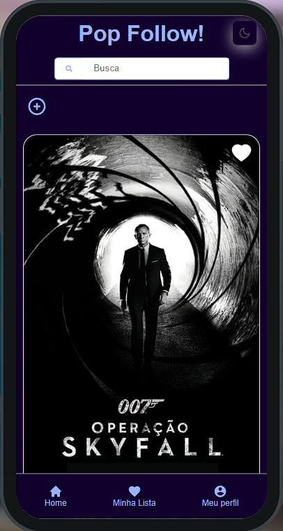

# Pop Follow Server

Este é um backend construído em Node.js, com o framework Express e banco de dados MongoDB. Ele foi projetado para lidar com títulos, como séries, filmes e animes.

# Funcionalidades 

- Catálogo de títulos disponíveis para os usuários (Usando a API do TMDB)
- Possibilidade de favoritar títulos e marcar como assistidos
- Adicionar novos títulos ao catálogo, incluindo informações como nome, gênero e sinopse
- Autenticação de usuários com cadastro e login. Incluindo opção de login via Google(para implementação futura, mas já preparado no back end)

## Licença

[](https://choosealicense.com/licenses/mit/)

## Autores

- [@OtavioCleyderman](https://github.com/OtavioCleyderman)

# Estrutura e stack utilizada

**Stack:** Node, Express, Axios, MongoDB(Mongoose), Bcrypt...

**Estrutura do projeto:**

```shell
  $ server
  ├── controllers
  │   ├── api.js
  │   ├── titleController.js
  │   └── userController.js
  ├── middlewares
  │   ├── checkPermission.js
  │   └── checkToken.js
  ├── models
  │   ├── FavoriteTitle.js
  │   ├── Title.js
  │   ├── User.js
  │   └── Watched.js
  ├── .gitignore
  ├── package-lock.json
  ├── package.json
  ├── routes.js
  ├── server.js
  └── vercel.json

```

## Demonstração

Projeto rodando na bohr.io, a primeira plataforma serverless brasileira, vale a pena conferir: https://popfollow.bohr.io/

Projeto rodando na vercel: https://popfollow.vercel.app/

### Prévia layout Desktop


### Prévia layout Mobile


## Para rodar o projeto em sua máquina

Clone este repositorio ou baixe o código fonte. Em seguida, abra a pasta do projeto no seu editor de código favorito.

Após isso, instale as dependências do projeto, rode no terminal:
```
    yarn 
```
ou, se preferir:
```
    npm install 
```
Após as dependências do projeto serem instaladas, inicie a aplicação rodando no terminal o comando:
```
    yarn dev 
```
ou, se preferir:
```
    npm run dev 
```

Pronto, após realizar os passos acima o projeto já iniciou e está rodando na porta **3000**. Acesse o seu navegador favorito e digite na barra de endereço dele:
```
    http://localhost:3000/
```

# Próximos passos do projeto como um todo (front e back)

- [ ]  Adicionar melhorias na navegação
- [ ]  Habilitar o cadastro e login com o Google
- [ ]  Inserir identificação nos títulos, quais vieram do TMDB e quais adicionados pelos usuário e qual usuário.
- [ ]  Criar páginas administrativas onde administradores poderão gerenciar os títulos, aprovar ou deletar títulos inseridos de forma inadequada ou títulos inexistentes etc.
- [ ]  Conforme avanço nos estudos sobre testes, implementa-los 
- [ ]  Refatorar o código e melhorar a performance
- [ ]  Parece que chegamos ao fim, mas não, sempre termos melhorias a acrescentar!

# Contrinuindo

Contribuições são sempre bem-vindas! Sinta-se à vontade para abrir uma issue ou enviar um pull request.

Ou também entrar em contato:

**LinkedIn:** www.linkedin.com/in/otavio-ferraz

**E-mail:** otavio.cleydermann@gmail.com